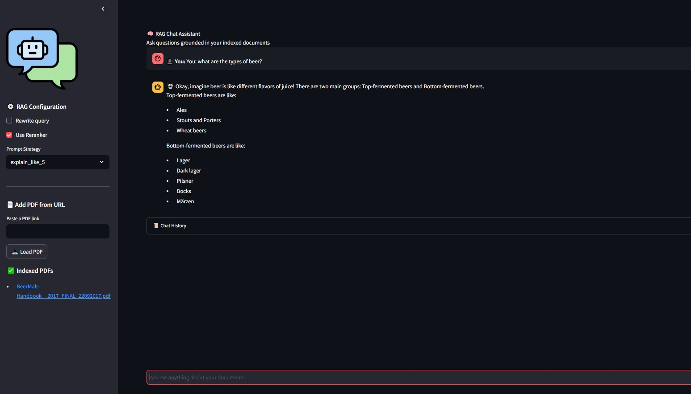

# 🤖 RAG Chat Assistant

A futuristic, interactive Retrieval-Augmented Generation (RAG) system powered by **Gemini**, **FAISS**, and a stylish **Streamlit GUI** — designed to answer domain-specific questions from documents like rulebooks, manuals, and more.



---

## 🚀 Features

- ✅ Conversational interface styled like ChatGPT
- 🔍 Context-aware search with FAISS vector store
- 🧠 Optional reranking using CrossEncoder
- 🎯 Prompt strategies:
  - `zero_shot`: direct answering
  - `cot`: chain-of-thought reasoning
  - `react`: reasoning + action
- 🧾 Memory-enabled multi-turn RAG
- 📜 Chat history and Markdown-friendly answers

---

## 📦 Components

| Module         | Purpose                                |
|----------------|----------------------------------------|
| `Gemini`       | Large language model (LLM)             |
| `FAISS`        | Efficient vector similarity search     |
| `LangChain`    | Orchestration of LLM + retriever       |
| `Streamlit`    | Interactive frontend                   |
| `CrossEncoder` | (Optional) reranker for better accuracy|

---

## 🛠️ Setup

### 1. Environment
Make sure you have:
- Python ≥ 3.9
- Your `GEMINI_API_KEY` set in environment variables

### 2. Install dependencies
```bash
pip install -r requirements.txt
```

### 3. Run the app
```bash
streamlit run app.py
```

---

## 🧪 Example Queries

You can try:

- `How to win a game?`
- `What is haste?`
- `Explain the stack rule in MTG.`
- `What are Prize cards in Pokémon TCG?`

---

## 📄 Documents Used

By default, the system loads and indexes:
- **Magic: The Gathering Comprehensive Rules**
- **Monopoly rulebook**
- **Pokemon TCG rulebook**

---

## 💡 Notes

- Reranking is optional and configurable.
- Prompt type affects how the assistant reasons.
- Answers are grounded in the indexed documents, not open-ended hallucinations.

---


## 🧾 License

MIT — use freely and responsibly.
